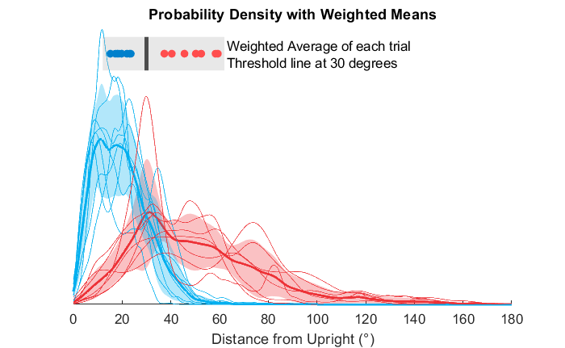
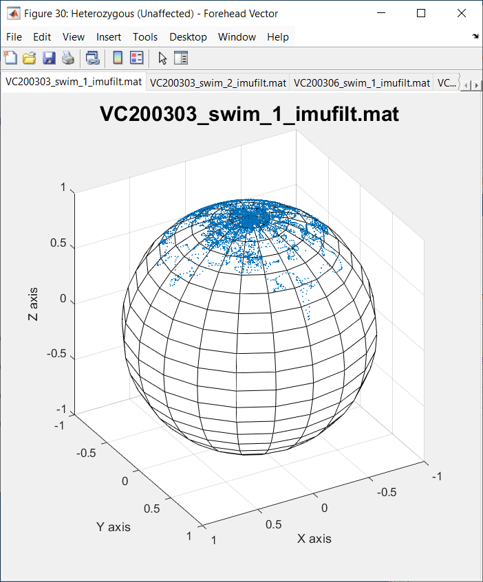
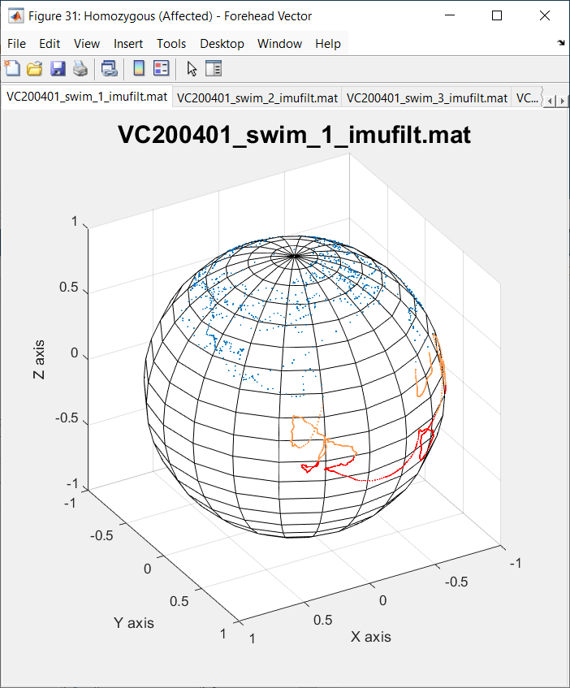

# SWIMU Swim Test

## About
This repository contains scripts and example data to accompany the paper
[***Instrumented swim test for quantifying motor impairment in
rodents***](https://www.nature.com/articles/s41598-024-80344-y) , Hughes,
Roberts, Tarchini, Cullen, Scientific Reports (Nature open-access) **14**, 29270
(2024). DOI: https://doi.org/10.1038/s41598-024-80344-y.

The approach uses an Inertial Measurement Unit (IMU) sensor chip to collect linear acceleration and angular velocity data from the chip's 3-axis accelerometer and 3-axis gyroscope sensors during swim test trials, and processes the data using a "sensor fusion" algorightm to track the subject's orientation in space with the aim of distinguishing subjects having vestibular deficits.

The repository contains Matlab ".mat" binary files of the experimental data used for the paper. The data are in two subdirectories, one for Heterozygous (unaffected) and one for Homozygous (affected) subjects. Scripts are provided which reproduce several plots used for figures in the paper.

## Install

Running the scripts requires a recent version of
[**Matlab®**](https://www.mathworks.com/). The scripts have been tested on version
R2024b, but may also run on other versions.

* Download this repository as a ZIP file and unzip it to a folder on your
  computer, or use git to clone the repository.
* Start Matlab, and set Matlab's Current Folder to the folder where the repository was extracted/downloaded.


## Running the Scripts

Run the scripts by typing their names at the Matlab command line.

* After making sure that the Matlab Current Folder is set to the folder containing the scripts from the repository, you must first run **`PlotAllMice`**. This will load all data from the **Heterozygous** and **Homozygous** subfolders into the Matlab workspace, and produce the Distance from Upright histogram and Probability Density with Weighted Means. These serve as the basis for Figure 6 in the paper. The main components of the data structure read from the mat files are:


  ```
  Acc: Nx3 matrix of IMU linear acceleration X, Y, and Z values, in G (gravity) units.
  Gyr: Nx3 matrix of IMU angular velocity X, Y, and Z values, in degrees/sec.
  q: Quaternion output from the imufilter sensor fusion process.
  R: Rotation Matrix equivalent representation of the Quaternions.
  ```


  * Shown here is the Probability Density plot, with the **Weighted Averages**, which successfully distinguish unaffected (**BLUE**) vs affected (**RED**) subjects. Each "dot" in the Weighted Average box represents the average Distance from Upright for single trace (a single swim trial), weighted by the probability of the distance.

    


* Next run **`Plot3DAll`**, which will produce two figure windows containing tabbed layouts of Sphere Plots. The figure windows are labeled in the window title bar for Heterozygous (unaffected) and Homozygous (affected), and each figure tab contains the name of the respective data file.

  * These plots show the endpoint of the "Forehead" vector (as described in the paper), which effectively shows how well the subject keeps its forehead pointed upward during swimming.

  * Note that the plots of the unaffected mice generally show the blue dots clustered near the upright "North Pole" of the sphere.

  * By contrast, plots of the affected mice show data points scattered farther from upright, with **Orange** indicating data points with Z values between 0.4 down to 0.0, and **Red** indicating data points with Z values below 0.0 (forhead effectively "under water").

  * You may use the mouse wheel to quickly flip between figure tabs, or simply click on each tab, or the tab navigation arrow icons above the figure title.

  * You may click the built-in Matlab "3D Rotation" icon while hovering the mouse near the top of the figure, to enable 3D rotation of the sphere using the mouse (see Matlab documentation for details). Note that this will temporarily disable the mouse-wheel tab-flip feature (un-click 3D Rotation to re-enable mouse-wheel tab navigation).

  |  |  |
  | :--: | :--: |
  | Tabbed view of unaffected subject | Tabbed view of affected subject (note the orange and red portions of the trace, which are far from upright) |


## Sensor Fusion with Matlab's imufilter()

The data files provided in this repository already have the output of Matlab's imufilter() "sensor fusion" algorightm, so the provided scripts do not implement that step. Here we describe the basic steps to convert calibrated IMU acceleration and gyroscope data into the "heading/orientation" rotation matrices used for the above analyses. This should enable others to convert IMU data from their own sensor systems so that the above analyses can be run.

* It is important that the Accelerometer and Gyroscope data are already correctly calibrated, and any sensor "offset" artifacts are already removed, otherwise the imufilter() process will not correctly track the subject orientation.
  * Gyroscope data should have all offsets removed, so that when the sensor is not moving, all 3 gyroscope signals have a mean of zero.
  * Gyroscope data should be correctly calibrated to degrees/second.
  * Accelerometer data should be correctly calibrated in 'G' gravity units, such that if the sensor chip is oriented along each of its positive and negative X, Y, and Z axes, the values should be as close to 1.0 or -1.0 as possible.

* Matlab's imufilter() sensor fusion algorightm expects acceleration inputs in meters/second<sup>2</sup>, and angular velocity in radians/second, so the code example below provides conversion factors for G and degrees/second.
* Edit the code as necessary to set SampRate to your IMU sensor's sample rate.

This code demonstrates the basic approach for converting accelerometer and
gyroscope data to rotation matrices:

```matlab
% Use imufilter() sensor fusion to generate Rotation Matrix "headings" from
% Accelerometer and Gyroscope data.
%
% Parameters:
%
% - Acc is an Nx3 matrix, where N is the number of data samples, and the 3
% columns contain the X, Y, and Z axes of acceleration data, calibrated in
% G.
%
% - Gyr is an Nx3 matrix where the 3 columns contain the X, Y, and Z axes
% of angular velocity "gyroscope" data, calibrated in degrees/second.
%
% Output:
%
% - R is the 3x3xN Rotation Matrix output, used for further analysis and
% plotting.

function R = MakeMat(Acc, Gyr)

SampRate = 500;
GtoA = 9.80665; % Convert acceleration in G to m/s^2.

% Generate the Sensor Fusion function.
FUSE = imufilter('SampleRate', SampRate);

% Call the sensor fusion function to convert Accel and Gyro to a
% Quaternion which represents the IMU heading.
q = FUSE(Acc.*GtoA, deg2rad(Gyr));

% Convert the Quaternions to Rotation Matrices.
R = rotmat(q, 'point');

```

After obtaining the 'R' Rotation Matrix output, you could, for instance, plot endpoints of the Z vector on a sphere using `Plot3D(R)`, to produce a Sphere Plot as shown above. If an opaque sphere is preferred, pass "false" as the second parameter to turn off transparancy: `Plot3D(R, false)`.
